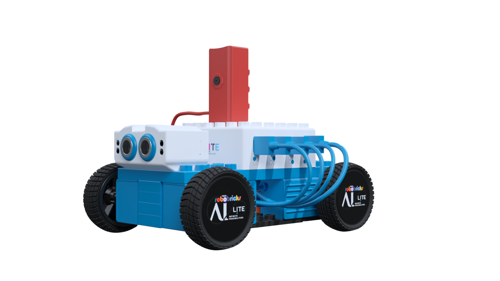

# AI-Lite

    

    

AI-Lite is a cutting-edge autonomous robot designed for a wide range of applications. With its sophisticated four-wheel drive system, integrated camera, ultrasonic sensors, IR sensor, color sensor, and touch sensor, AI-Lite is capable of navigating complex environments with precision and intelligence.

# AI-Lite using Python

AI-Lite is a cutting-edge autonomous robot that uses Python as its primary programming language. It is equipped with various sensors and modules, including an ultrasonic sensor, infrared sensor, color sensor, and touch sensor, which enable it to navigate complex environments with precision and intelligence. With Python, users can program AiLite to perform various tasks, such as object detection, face recognition, and speech recognition, making it an ideal solution for both educational and industrial purposes. For more details visit https://github.com/robotixdevteam/AI-Lite/tree/Python

# AI-Lite using MIT App

AiLite can be controlled and programmed using MIT App Inventor, a visual programming tool that allows users to create mobile apps. By connecting AiLite to the MIT App Inventor interface, users can design and develop custom projects that interact with the robot, utilizing its various sensors and capabilities. For more details visit https://github.com/robotixdevteam/AI-Lite/tree/MIT-Applications
